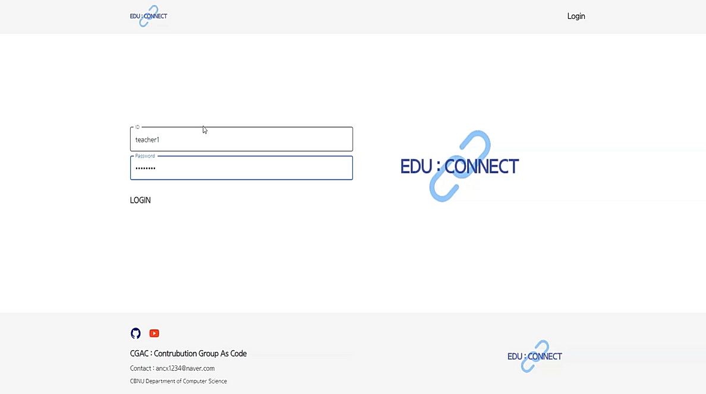
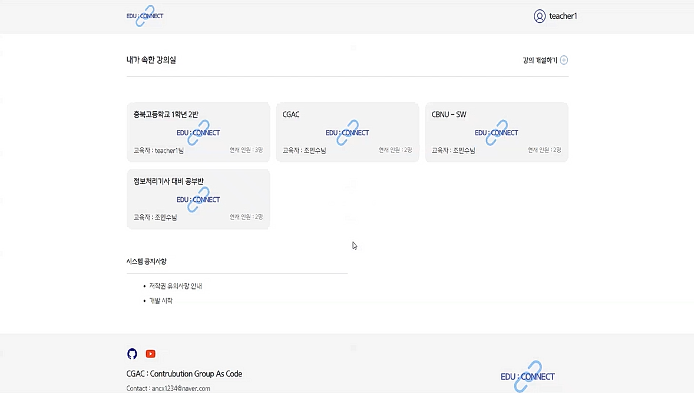
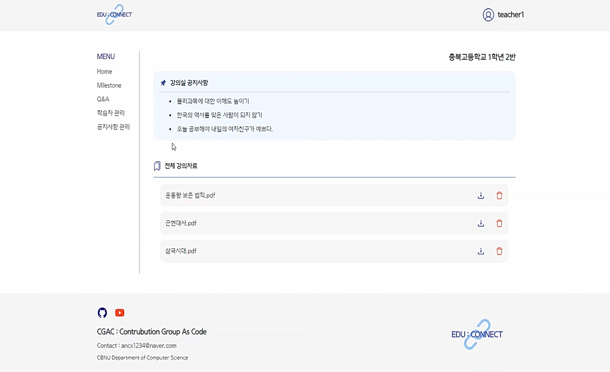
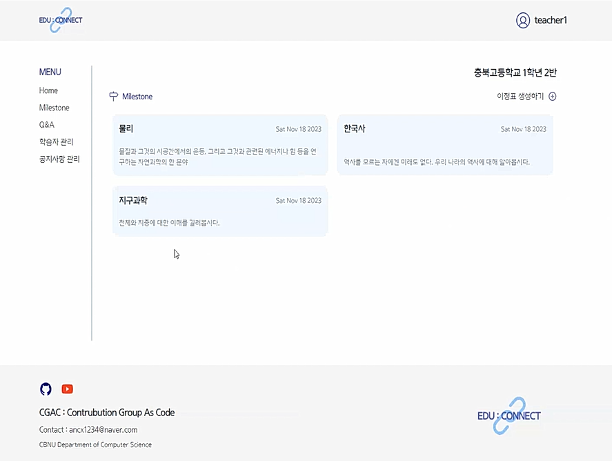
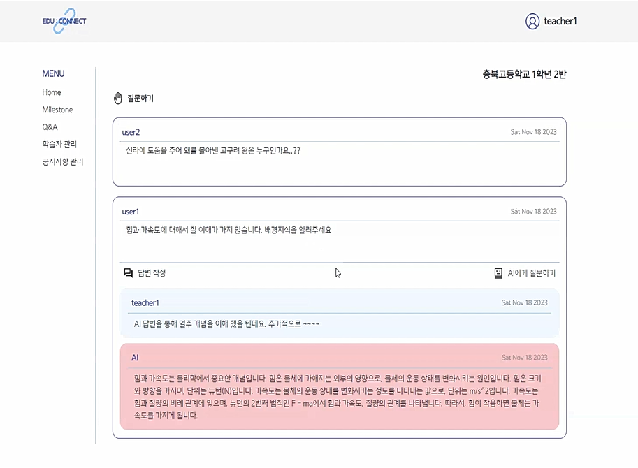
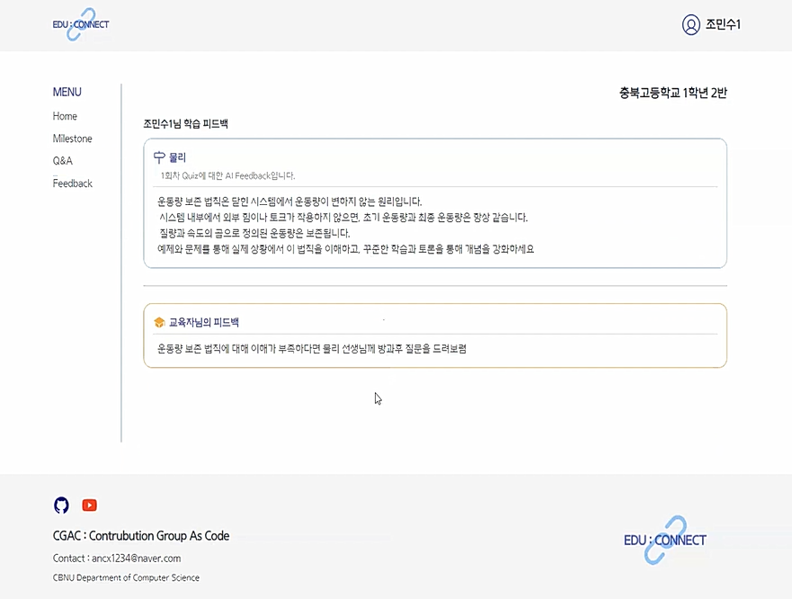
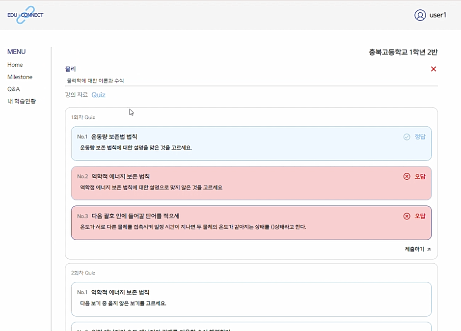
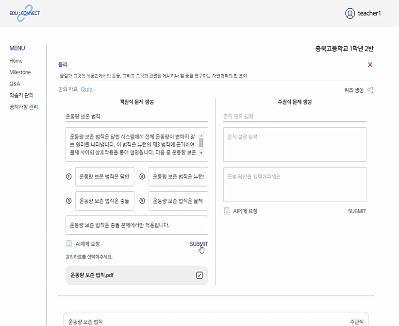

# EDU:CONNECT
### Front End
by 조민수 @lookinmin

## 2023년도 충북 ICT 메이커톤 본선 진출작 EDU:CONNECT

팀 CGAC : Contribution Group As Code  
Leader : 조민수  
Mates : 김광모, 서종원  

#

### Project 개요
온라인 교육환경(LMS)에 ChatGPT API를 결합한 AI 활용 온라인 LMS 구현

### Project 의의 및 기능
- 하이브리드 교육 환경과 에듀테크 기반 산업 성장 흐름에 기여.
- 교육자가 AI를 통해 손쉽게 Quiz를 생성하고 학습자에게 더 나은 학습의 질 부여
- AI가 학습자의 상태를 판단해 Feedback 생성
- 학습자는 AI Q&A를 통해 빠르게 애로 사항 해결

### Front End 개발 환경
- Language : TypeScript
- Framework : React TS, Material UI, React Bootstrap
- UI/UX 기획 및 설계 : Figma
- 사용 기술 : Redux.ts, React-Query, MediaQuery, styled component
- IDE : VSCode, eslint, prettier

#

## 화면 구성
### 1. Login  

  

# 

### 2. Main  

  

#

### 3. 강의실 개설  

  

#

### 4. 강의실 > Home  

  

#

### 5. 강의실 > Milestone System  

  

#

### 6. 강의실 > Q&A System  

  

#

### 7. 강의실 > Feedback System  

  

#

### 8. 강의실 > MileStone > Quiz  

  

#

### 9. 교육자 > 강의실 > 퀴즈 생성  

  

  

